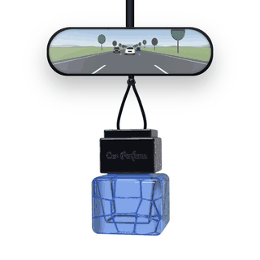

  

# Finance Portfolio · George Murad

**See it as a website: [jrejl.github.io/FinancePortfolio](https://jrejl.github.io/FinancePortfolio/)**

Work samples in financial reporting, FP&A, accounting and data analysis. Six practice case studies, each built from
scratch for a kind of finance role I am applying for, four Python analyses that run on their data, and the books of
Escentials, my own e-commerce business. Every model is an Excel workbook with live formulas and a Checks sheet that
proves it ties.

> **Illustrative figures.** The practice companies are fictional. Escentials is a real business; its figures are
> illustrative for privacy, modeled on its size, sales channels and products, not its actual results.

## Practice Case Studies

| Case | Practice Focus | Built For | Files |
|---|---|---|---|
| [Aldercrest Aerospace](https://jrejl.github.io/FinancePortfolio/aldercrest-aerospace/) | Earned Value Management (EVM) | Program finance and cost analyst roles in aerospace and defense | [Excel](aldercrest-aerospace/Aldercrest_FY2025_Financial_Model.xlsx) · [PDF](aldercrest-aerospace/Aldercrest_FY2025_Financial_Model.pdf) |
| [Lumenpath Software](https://jrejl.github.io/FinancePortfolio/lumenpath-software/) | SaaS Metrics and DCF Valuation | FP&A and corporate finance roles at software companies | [Excel](lumenpath-software/Lumenpath_FY2025_Financial_Model.xlsx) · [PDF](lumenpath-software/Lumenpath_FY2025_Financial_Model.pdf) |
| [Saltbrush Beverage](https://jrejl.github.io/FinancePortfolio/saltbrush-beverage/) | Standard Costing and Variance Analysis | Cost analyst and manufacturing finance roles | [Excel](saltbrush-beverage/Saltbrush_FY2025_Financial_Model.xlsx) · [PDF](saltbrush-beverage/Saltbrush_FY2025_Financial_Model.pdf) |
| [Sunfield Kitchen Group](https://jrejl.github.io/FinancePortfolio/sunfield-kitchen/) | Unit Economics and Cohort Analysis | FP&A and operations finance roles in restaurants and retail | [Excel](sunfield-kitchen/Sunfield_FY2025_Financial_Model.xlsx) · [PDF](sunfield-kitchen/Sunfield_FY2025_Financial_Model.pdf) |
| [City of Palomar Vista](https://jrejl.github.io/FinancePortfolio/palomar-vista/) | Government Budgeting and Fund Accounting | Budget analyst roles in city and county government | [Excel](palomar-vista/Palomar_Vista_FY2025_Financial_Model.xlsx) · [PDF](palomar-vista/Palomar_Vista_FY2025_Financial_Model.pdf) |
| [Saltbrush Beverage: December Close](https://jrejl.github.io/FinancePortfolio/saltbrush-close/) | Month End Close | Staff accountant and financial reporting roles | [Excel](saltbrush-close/Saltbrush_December_2025_Close.xlsx) · [PDF](saltbrush-close/Saltbrush_December_2025_Close.pdf) |

## Python for Finance

Four pandas scripts that run on the case study data. Each one writes the tables, charts and workbook shown on
[its page on the website](https://jrejl.github.io/FinancePortfolio/strengths/python/).

| Script | The Question It Answers |
|---|---|
| [ratio_analyzer.py](python/ratio_analyzer.py) | How do profitability, liquidity and leverage compare across Aldercrest, Lumenpath, Saltbrush and Sunfield in FY2025? |
| [variance_flags.py](python/variance_flags.py) | Which budget lines at Sunfield Kitchen, Palomar Vista and Escentials moved enough from budget to need a look? |
| [cash_simulation.py](python/cash_simulation.py) | How much of its 8,000 revolver could Saltbrush need over the next 13 weeks if customer receipts vary? |
| [evm_forecast.py](python/evm_forecast.py) | Given the cost and schedule performance on ALX-7 through December 2025, where does the program end up? |

## Escentials: My Business

Escentials is my e-commerce business: designer fragrance, plus its own Car Perfume line, which hangs from the
rearview mirror in live 3D on [shopescentials.com](https://shopescentials.com). Its FY2025 books are below, and
[as a web page](https://jrejl.github.io/FinancePortfolio/escentials-llc/). The best parts of the store are on
[the website page](https://jrejl.github.io/FinancePortfolio/store/).

| Folder | What It Holds |
|---|---|
| [1 Financial Statements](escentials-llc/1_Financial_Statements/) | Income statement, balance sheet, cash flows, members' equity and notes, each in Excel and PDF |
| [2 FP&A Analysis](escentials-llc/2_FPA_Analysis/) | Budget versus actual, the FY2026 forecast, the KPI dashboard and the SQL analysis |
| [3 Supporting Schedules](escentials-llc/3_Supporting_Schedules/) | Monthly statements, roll forwards, the budget, assumptions, the data pull and the model checks |
| [4 Full Excel Model](escentials-llc/4_Full_Excel_Model/) | The whole model in one workbook: 18 sheets, live formulas and 15 checks |
| [5 SQLite Database](escentials-llc/5_SQLite_Database/) | The transaction database, its schema, the queries and their results |
| [6 CRM Database](escentials-llc/6_CRM_Database/) | Customer segments, cohorts, repeat purchase and the customer report |
| [7 Tableau](escentials-llc/7_Tableau/) | The dashboards workbook |
| [8 PowerPoint](escentials-llc/8_PowerPoint/) | The FY2025 business review deck |

 

## Tools

Excel · Python (pandas, NumPy, matplotlib) · SQL (SQLite) · Tableau · Power BI · PowerPoint

## Contact

[georgebasilmurad@gmail.com](mailto:georgebasilmurad@gmail.com) · [LinkedIn](https://www.linkedin.com/in/georgemurad)
